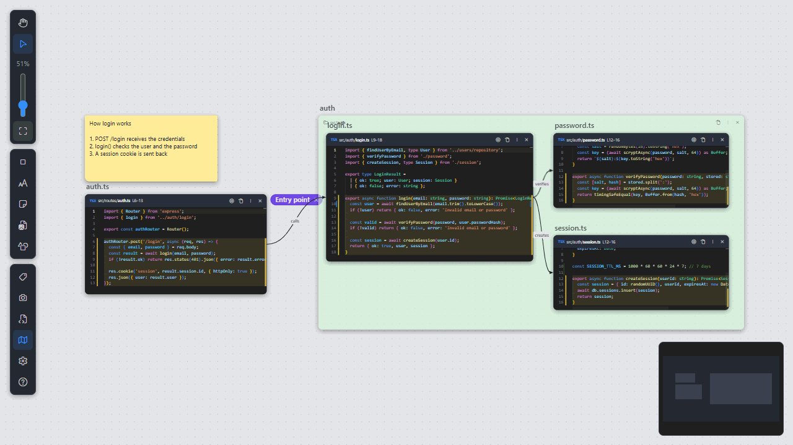

# Paper Workspace

Lay your code out like papers on a desk. Paper Workspace opens pieces of your files as movable, **editable** papers on
an infinite canvas, so you can see how the parts of your software connect and change them right there.

Works in **VS Code**, **Cursor** and **Windsurf / Devin**.

> **Early preview.** Paper Workspace is an open-source project and is still evolving. Feedback, bug reports and ideas
> are very welcome in [GitHub issues](https://github.com/brucegroverlee/paper-workspace/issues).

## Why

Tabs show one file at a time. Real work spans many: a route, its handler, the service it calls, the test that covers
it. Paper Workspace puts exactly the lines you care about side by side, keeps them live and editable, and saves the
layout so you (or your team, or your AI agent) can come back to it.

- **Understand** a feature or a bug by laying out the code paths that matter.
- **Review** a branch or PR with every changed snippet on one canvas, Git gutter included.
- **Explain** a system with code, diagrams, notes and images in one place, and share it as a file in the repository.

## Highlights

- **Live code papers**: each paper is a real editor bound to lines of a file. Edits are written to the file, with your
  theme's colors, IntelliSense, go to definition and Git change marks.
- **Infinite canvas**: pan, zoom, minimap, folders, groups, links, sticky notes, text, images and draw.io-style shapes.
- **Workspaces you can commit**: canvases are `.workspace` files in `.paperworkspace/`, safe to check in and share.
- **Fast capture**: press **Ctrl+Alt+P** (Cmd+Alt+P) on a selection, Shift+drag files from the Explorer, or turn on
  *Take over* mode to add every file you open.
- **Share**: save a PNG snapshot, export a workspace as a single `.paperbundle`, or copy and paste between workspaces.
- **AI ready**: copy a reference to any item and paste it into an AI chat. The included
  [Agent Skill](docs/ai-skill.md) teaches agents such as Claude Code, Codex, Cursor and Devin to read, explain, build
  and update workspaces.

See the [full feature list](docs/features.md).

## Getting started

1. Open the **Paper Workspace** panel in the activity bar and create a workspace.
2. Select some code and press **Ctrl+Alt+P** (Cmd+Alt+P), or Shift+drag a file from the Explorer onto the canvas.
3. Move, resize and edit papers. **Ctrl+S** saves the layout and every changed file.

## Install

- **VS Code**: [Visual Studio Marketplace](https://marketplace.visualstudio.com/items?itemName=GroverLee.paper-workspace)
- **Cursor, Windsurf / Devin, VSCodium and other VS Code forks**:
  [Open VSX](https://open-vsx.org/extension/GroverLee/paper-workspace)

Or search *Paper Workspace* in the Extensions view.

## Documentation

- [Features](docs/features.md): everything the extension does, settings and limitations
- [Use the AI skill](docs/ai-skill.md): add the Agent Skill to your AI coding tool
- [Local development](docs/development.md): build, run and test from source
- [Publishing](docs/publishing.md): release checklist for the marketplaces
- [Design](DESIGN.md): architecture and the `.workspace` file format

## License

[MIT](LICENSE)
